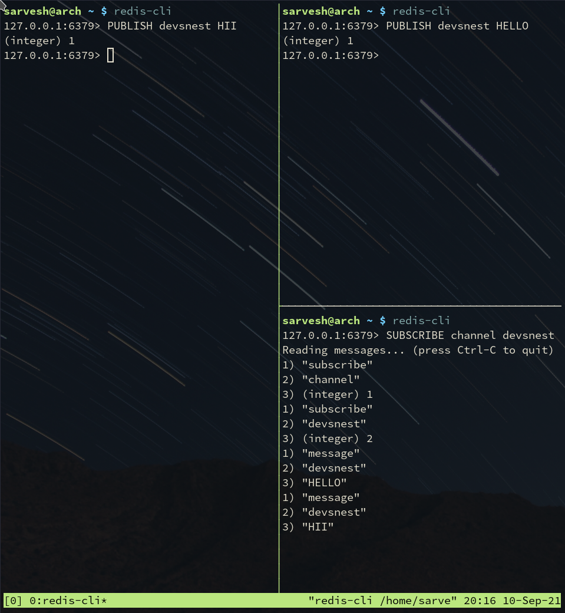

# Day 3


## Simulating a chat application using PUB-SUB

- To Subscribe the channel
```
SUBSCRIBE channel [channel_name]
```

- To Publish to the channel
```
PUBLISH channel [message]
```
### Demo



<h1></h1>

## Basic redis commands

- SET key value
- GET key
- ttl key
- KEYS *
- DEL key
- FLUSHALL
- EXISTS key
- expire key time
- setex key time value

##### For Arrays

- LPUSH array value
- RPUSH array value
- LRANGE array start stop
- LPOP array
- RPOP array


##### For Sets

- SADD myset value
- SMEMBERS myset


##### For Object/Hash

- HSET key field value 
- HGET key field
- HGETALL key
- HDEL key field
- HEXISTS key field